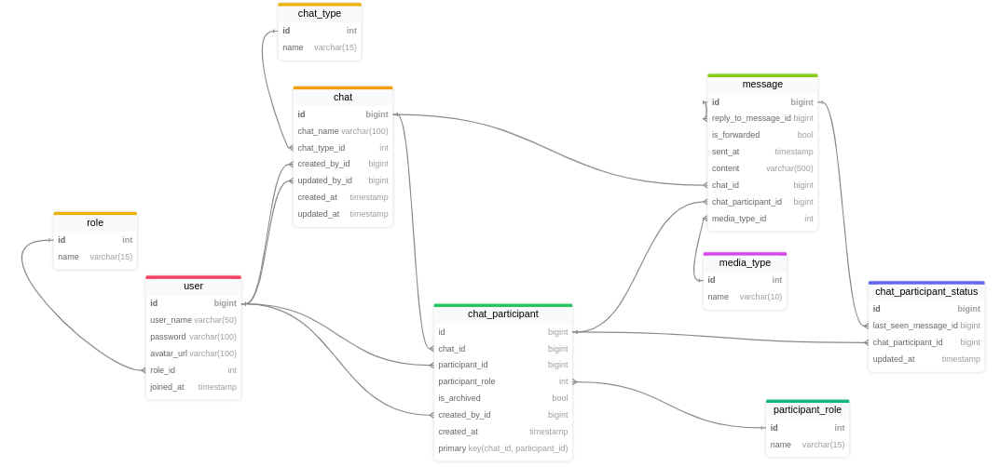

<h1 style="text-align: center;">
  
</h1>

<b>Connectly</b> is a learning-oriented chat application built with <b>Spring Boot</b>! This project is intended as
a reference for new developers to understand the workings of core Spring Boot components in a real-world scenario.

> **Note:** This project is for **learning purposes only**. It is designed to guide beginners through fundamental
> concepts, offering hands-on insight into how Spring Boot is used to develop a feature-rich chat app.

## 📜 **About Connectly**

**Connectly** provides the typical features you’d expect in a chat application, giving a foundation to learn and extend
Spring Boot functionalities. In this project, you'll find examples and implementations of essential chat app features,
including:

- **One-to-One and Group Chats**: Communicate directly with individuals or participate in group conversations.
- **Real-Time Messaging**: Experience immediate message updates thanks to WebSocket integration.
- **User Roles and Permissions**: Different roles, such as admins and members, allow for specific actions within group
  chats.
- **Authentication and Registration**: A combined registration and login system simplifies user access.

This app serves as a practical example for anyone looking to understand Spring Boot concepts in a chat application
context. Whether you're curious about real-time updates, database design, or user management, Connectly provides a
helpful starting point.

---

## ✅ **Tasks**

Below is a checklist of tasks to complete in developing Connectly. Each task is a stepping stone toward building a
fully-functional chat application with Spring Boot.

- [X] Set up the Spring Boot project structure
- [ ] Define core tables and relationships between tables
- [ ] Define each table attributes
- [ ] Implement user registration and login
- [ ] Implement chat user interface
- [ ] Integrate WebSocket for real-time messaging
- [ ] Build backend messaging logic for one-to-one and group chats
- [ ] Set up message delivery and persistence in the database

---

## 🗄️ Database Design

Connectly’s database design includes several core tables to manage users, chats, messages, and roles. Each table serves
a specific purpose in the chat application, as detailed below.

### **Tables**

- **User**: Stores essential information for each user, such as username, password, avatar URL, and role, along with
  metadata like the user's role and when they joined.

- **Role**: Defines the general roles available in the app, which could include roles such as user or moderator. This
  allows for role-based access control at the application level.

- **Chat**: Represents a chat session, storing details about the chat’s name, type, creator, and last updater. This
  table supports both one-to-one and group chats by associating each chat with a specific type.

- **MediaType**: Defines the types of media that messages can contain, such as text, image, or video, helping categorize
  the message content.

- **ChatType**: Specifies the types of chats, such as "private" or "group," allowing Connectly to distinguish between
  different chat structures.

- **ChatParticipant**: Manages the participants in each chat, indicating which users are part of which chats. This table
  also tracks participants' roles within the chat, whether a participant has archived the chat, and other
  participant-specific details.

- **ChatParticipantStatus**: Tracks the status of each participant within a chat, including the last message seen and
  when the status was last updated, supporting features like read receipts and message tracking.

- **Message**: Stores all messages sent within chats, including metadata such as whether the message was forwarded, the
  timestamp, any media type, and any referenced message (for replies).

- **ParticipantRole**: Defines the roles specific to participants within a chat (e.g., admin, member), allowing for
  role-based permissions within chat groups.

### **Entity-Relationship Diagram (ERD)**

Below is the Entity-Relationship Diagram (ERD) that visually represents the database structure:

  

---
